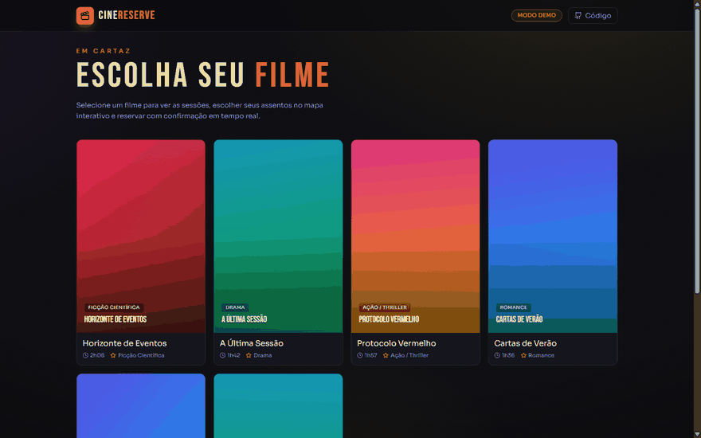

# CineReserve API


**API RESTful de alta performance para gerenciamento de operações de cinema moderno** - descoberta de filmes, visualização de assentos em tempo real e reserva de ingressos com controle de concorrência.

> Desenvolvido para o **Cinépolis Natal**

### Demo ao vivo

[](https://leonardopcavalcanti.github.io/cinereserve/)

**[leonardopcavalcanti.github.io/cinereserve](https://leonardopcavalcanti.github.io/cinereserve/)** — frontend React que consome esta API: filmes em cartaz → sessões → **mapa de assentos interativo** → reserva com lock de concorrência → checkout com ingresso. O GIF acima é o fluxo real do demo.

> Projeto **full-stack**: backend Django REST (este repositório) + frontend React em [`frontend/`](frontend/). O demo roda em modo simulado (mock) para funcionar sem o backend hospedado; basta definir `VITE_API_BASE` para apontar à API real.

---

## O que este projeto ensina

> Este projeto é, antes de tudo, um estudo prático de **controle de concorrência** — o problema clássico de duas pessoas tentando reservar o mesmo assento no mesmo instante. Abaixo, os conceitos de Ciência da Computação que ele torna tangíveis.

### 1. Condição de corrida (race condition)
Sem coordenação, dois pedidos simultâneos podem ler "assento livre" e **ambos** gravar a reserva — o assento é vendido duas vezes. É o exemplo canônico de *lost update*. A solução exige uma operação **atômica**: ler-e-escrever como um passo indivisível.

### 2. Lock distribuído com Redis (`SET NX EX`)
O assento é travado com uma única operação atômica:
```
SET seat_lock:{sessao}:{assento} {user_id} NX EX 600
```
- **`NX`** (*set if Not eXists*) — só cria a chave se ela ainda não existir. É isto que vence a corrida: apenas **um** dos pedidos consegue criar o lock; o outro recebe `409 Conflict`.
- **`EX 600`** — *time-to-live* de 10 minutos. Se o usuário abandonar o carrinho, o lock **expira sozinho**, evitando assentos eternamente presos.

### 3. Liberação segura com script Lua (check-and-delete atômico)
Liberar um lock não é só `DELETE`: é preciso garantir que **só o dono** o libere. Um *check-then-act* ingênuo (`GET` e depois `DEL`) tem sua própria janela de corrida. Por isso a liberação roda um **script Lua** no Redis — que executa de forma atômica: "se o valor for meu, apague". Mesmo padrão do algoritmo de lock distribuído *Redlock*.

### 4. Idempotência e expiração assíncrona
Um worker **Celery Beat** varre o banco a cada 60s reconciliando locks expirados no Redis com o status no PostgreSQL — um exemplo de **processo de reconciliação** entre duas fontes de verdade (cache rápido x banco durável).

### 5. Performance de banco: o problema N+1
Listar sessões com seus filmes pode disparar 1 query + N queries (uma por filme). O projeto usa `select_related`/`prefetch_related` para resolver tudo em poucos JOINs — o antídoto clássico ao **N+1 query problem**.

### 6. Autenticação stateless com JWT
*JSON Web Tokens* permitem autenticar sem sessão no servidor (escala horizontalmente), ao custo de não poder "deslogar" um token. O projeto contorna isso com uma **blacklist** de refresh tokens — a discussão clássica sobre o trade-off entre statelessness e revogação.

**Leituras de referência:**
- Martin Kleppmann, *Designing Data-Intensive Applications* — cap. 7 (Transações) e cap. 8 (concorrência e *lost updates*).
- [Distributed Locks with Redis](https://redis.io/docs/manual/patterns/distributed-locks/) — documentação do padrão Redlock.
- [The N+1 Query Problem](https://docs.djangoproject.com/en/stable/topics/db/optimization/) — otimização de queries no Django.

---

## Início Rápido

```bash
# 1. Clone e configure
git clone https://github.com/LeonardoPCavalcanti/cinereserve.git
cd cinereserve
cp .env.example .env

# 2. Suba tudo (Postgres, Redis, API, Celery)
docker-compose up --build -d

# 3. Popule com dados de exemplo
docker-compose exec web python manage.py seed_data

# 4. Rode os testes (30 testes)
docker-compose exec web pytest -v

# 5. Swagger — documentação interativa da API
# http://localhost:8000/api/docs/

# 6. Encerrar
docker-compose down
```

> Nenhuma configuração adicional necessária. Basta ter Docker instalado.

---

## Sumário

- [O que este projeto ensina](#o-que-este-projeto-ensina)
- [Visão Geral](#visão-geral)
- [Stack Tecnológica](#stack-tecnológica)
- [Arquitetura do Projeto](#arquitetura-do-projeto)
- [Modelagem do Banco de Dados](#modelagem-do-banco-de-dados)
- [Como Executar](#como-executar)
- [Endpoints da API](#endpoints-da-api)
- [Autenticação](#autenticação)
- [Fluxo de Reserva](#fluxo-de-reserva)
- [Testes](#testes)
- [Documentação Swagger](#documentação-swagger)
- [Funcionalidades Implementadas](#funcionalidades-implementadas)
- [Decisões Técnicas](#decisões-técnicas)

---

## Visão Geral

O CineReserve API é um backend completo que permite:

- **Cadastro e autenticação** de usuários via JWT
- **Listagem de filmes** disponíveis com busca, filtros e paginação
- **Visualização de sessões** por filme com horários, salas e formatos
- **Mapa de assentos em tempo real** com status (disponível / reservado / comprado)
- **Reserva temporária** de assentos com lock distribuído via Redis (10 minutos)
- **Checkout** que transiciona a reserva para ingresso permanente
- **Portal "Meus Ingressos"** com tickets ativos e histórico completo

---

## Stack Tecnológica

| Componente | Tecnologia |
|---|---|
| Linguagem | Python 3.11 |
| Framework Web | Django 5 + Django REST Framework |
| Gerenciador de Dependências | Poetry |
| Banco de Dados | PostgreSQL 15 |
| Cache / Lock Distribuído | Redis 7 |
| Autenticação | JWT (SimpleJWT) |
| Tarefas Assíncronas | Celery + Celery Beat |
| Documentação | Swagger (drf-spectacular) |
| Containerização | Docker + Docker Compose |
| Testes | pytest + pytest-django |
| CI/CD | GitHub Actions |

---

## Arquitetura do Projeto

```
cinereserve/
├── config/                     # Configurações do Django
│   ├── settings/
│   │   ├── base.py             # Settings compartilhados
│   │   ├── development.py      # Settings de desenvolvimento
│   │   └── production.py       # Settings de produção
│   ├── urls.py                 # URLs raiz
│   ├── api_urls.py             # URLs da API v1
│   ├── celery.py               # Configuração do Celery
│   └── wsgi.py
├── apps/
│   ├── users/                  # Autenticação e perfil de usuário
│   ├── movies/                 # Catálogo de filmes
│   ├── sessions/               # Sessões de cinema
│   ├── seats/                  # Salas, assentos e status
│   └── tickets/                # Reservas, checkout e ingressos
├── core/
│   ├── pagination.py           # Paginação padrão
│   ├── permissions.py          # Permissões customizadas
│   └── redis_lock.py           # Lock distribuído com Redis
├── docker-compose.yml
├── Dockerfile
├── pyproject.toml
├── .env.example
└── .github/workflows/ci.yml   # Pipeline CI/CD
```

---

## Modelagem do Banco de Dados

```
┌──────────┐     ┌───────────────┐     ┌──────────┐
│   User   │     │ CinemaSession │────▶│  Movie   │
│  (UUID)  │     │    (UUID)     │     │  (UUID)  │
└────┬─────┘     └──────┬────────┘     └──────────┘
     │                  │
     │                  │         ┌──────────┐
     │                  └────────▶│   Room   │
     │                            │  (UUID)  │
     │                            └────┬─────┘
     │                                 │
     │           ┌────────────┐   ┌────┴─────┐
     │     ┌────▶│ SeatStatus │──▶│   Seat   │
     │     │     │  (UUID)    │   │  (UUID)  │
     │     │     └────────────┘   └──────────┘
     │     │
     ├─────┤
     │     │     ┌────────────┐
     └─────┴────▶│   Ticket   │
                 │  (UUID)    │
                 └────────────┘
```

### Modelos

- **User** - Estende AbstractUser com UUID e autenticação por email
- **Movie** - Catálogo de filmes com título, gênero, diretor, duração
- **Room** - Salas de cinema com configuração de fileiras e assentos
- **Seat** - Assentos físicos com label auto-computado (ex: "A1", "B5")
- **CinemaSession** - Sessão de um filme em uma sala, com horário, idioma e formato
- **SeatStatus** - Status do assento por sessão (available → reserved → purchased)
- **Ticket** - Ingresso gerado após checkout, com código único

---

## Como Executar

### Pré-requisitos

- [Docker](https://docs.docker.com/get-docker/) e [Docker Compose](https://docs.docker.com/compose/install/)

### Passo a passo

**1. Clone o repositório**

```bash
git clone https://github.com/LeonardoPCavalcanti/cinereserve.git
cd cinereserve
```

**2. Configure o ambiente**

```bash
cp .env.example .env
```

**3. Suba os containers**

```bash
docker-compose up --build -d
```

Isso inicia automaticamente:
- PostgreSQL 15 (porta 5432)
- Redis 7 (porta 6379)
- API Django/Gunicorn (porta 8000)
- Celery Worker
- Celery Beat (agendador de tarefas)

As migrations são executadas automaticamente na inicialização.

**4. Popule o banco com dados iniciais**

```bash
docker-compose exec web python manage.py seed_data
```

Cria: 10 filmes, 3 salas (80 assentos cada), 21 sessões nos próximos 7 dias.

**5. Acesse a API**

- API: http://localhost:8000/api/v1/
- Swagger UI: http://localhost:8000/api/docs/
- ReDoc: http://localhost:8000/api/redoc/

**6. Para parar os containers**

```bash
docker-compose down
```

> Para resetar completamente (incluindo dados): `docker-compose down -v`

---

## Endpoints da API

Base URL: `http://localhost:8000/api/v1/`

### Autenticação (`/auth/`)

| Método | Endpoint | Auth | Descrição |
|--------|----------|------|-----------|
| POST | `/auth/register/` | Nao | Cadastro de novo usuário |
| POST | `/auth/login/` | Nao | Login - retorna access + refresh JWT |
| POST | `/auth/token/refresh/` | Nao | Renova o access token |
| POST | `/auth/logout/` | Sim | Logout (blacklist do refresh token) |

### Filmes (`/movies/`)

| Método | Endpoint | Auth | Descrição |
|--------|----------|------|-----------|
| GET | `/movies/` | Nao | Lista filmes ativos (paginado, com busca e filtros) |
| GET | `/movies/{id}/` | Nao | Detalhes de um filme |
| GET | `/movies/{id}/sessions/` | Nao | Sessões de um filme específico |

### Sessões (`/sessions/`)

| Método | Endpoint | Auth | Descrição |
|--------|----------|------|-----------|
| GET | `/sessions/{id}/` | Nao | Detalhes de uma sessão |
| GET | `/sessions/{id}/seats/` | Nao | Mapa de assentos em tempo real |

### Reservas (`/reservations/`)

| Método | Endpoint | Auth | Descrição |
|--------|----------|------|-----------|
| POST | `/reservations/` | Sim | Reserva temporária de assento (10 min) |
| DELETE | `/reservations/{id}/` | Sim | Cancela reserva e libera o assento |

### Checkout (`/checkout/`)

| Método | Endpoint | Auth | Descrição |
|--------|----------|------|-----------|
| POST | `/checkout/` | Sim | Confirma reserva e gera ingresso |

### Ingressos (`/tickets/`)

| Método | Endpoint | Auth | Descrição |
|--------|----------|------|-----------|
| GET | `/tickets/` | Sim | Todos os ingressos do usuário |
| GET | `/tickets/active/` | Sim | Ingressos ativos (sessões futuras) |
| GET | `/tickets/history/` | Sim | Histórico completo |
| GET | `/tickets/{id}/` | Sim | Detalhes de um ingresso |

---

## Autenticação

A API usa **JWT (JSON Web Tokens)** para autenticação.

### Registrar

```bash
curl -X POST http://localhost:8000/api/v1/auth/register/ \
  -H "Content-Type: application/json" \
  -d '{
    "username": "leo",
    "email": "leo@example.com",
    "password": "minhasenha123",
    "password_confirm": "minhasenha123"
  }'
```

### Login

```bash
curl -X POST http://localhost:8000/api/v1/auth/login/ \
  -H "Content-Type: application/json" \
  -d '{
    "email": "leo@example.com",
    "password": "minhasenha123"
  }'
```

**Resposta:**
```json
{
  "user": { "id": "uuid", "username": "leo", "email": "leo@example.com" },
  "tokens": {
    "access": "eyJhbGciOi...",
    "refresh": "eyJhbGciOi..."
  }
}
```

### Usar o token

Inclua o header em todas as requisições autenticadas:

```
Authorization: Bearer <access_token>
```

### Exemplo completo: Fluxo de reserva via curl

```bash
# 1. Registrar
curl -X POST http://localhost:8000/api/v1/auth/register/ \
  -H "Content-Type: application/json" \
  -d '{"username":"leo","email":"leo@example.com","password":"minhasenha123","password_confirm":"minhasenha123"}'

# 2. Login (copie o access token da resposta)
curl -X POST http://localhost:8000/api/v1/auth/login/ \
  -H "Content-Type: application/json" \
  -d '{"email":"leo@example.com","password":"minhasenha123"}'

# 3. Listar filmes
curl http://localhost:8000/api/v1/movies/

# 4. Ver sessões de um filme (substitua {movie_id} pelo id retornado)
curl http://localhost:8000/api/v1/movies/{movie_id}/sessions/

# 5. Ver mapa de assentos (substitua {session_id})
curl http://localhost:8000/api/v1/sessions/{session_id}/seats/

# 6. Reservar assento (substitua {session_id}, {seat_id} e {TOKEN})
curl -X POST http://localhost:8000/api/v1/reservations/ \
  -H "Content-Type: application/json" \
  -H "Authorization: Bearer {TOKEN}" \
  -d '{"session_id":"{session_id}","seat_id":"{seat_id}"}'

# 7. Checkout (substitua {reservation_id} retornado no passo anterior)
curl -X POST http://localhost:8000/api/v1/checkout/ \
  -H "Content-Type: application/json" \
  -H "Authorization: Bearer {TOKEN}" \
  -d '{"reservation_id":"{reservation_id}"}'

# 8. Ver meus ingressos
curl http://localhost:8000/api/v1/tickets/ \
  -H "Authorization: Bearer {TOKEN}"

# 9. Ver ingressos ativos (sessões futuras)
curl http://localhost:8000/api/v1/tickets/active/ \
  -H "Authorization: Bearer {TOKEN}"

# 10. Ver histórico completo
curl http://localhost:8000/api/v1/tickets/history/ \
  -H "Authorization: Bearer {TOKEN}"
```

> **Dica:** Também é possível testar tudo pelo **Swagger UI** em http://localhost:8000/api/docs/ — clique em "Authorize" e cole o access token.

---

## Fluxo de Reserva

```
1. Usuário escolhe assento    →  POST /reservations/
   (Redis SET NX EX - lock atômico de 10 minutos)

2. Assento fica "reserved"    →  Outros usuários recebem 409 Conflict

3. Usuário confirma compra    →  POST /checkout/
   (Cria Ticket + status "purchased" + libera Redis lock)

4. Se não confirmar em 10min  →  Redis TTL expira automaticamente
   (Celery Beat atualiza banco a cada 60s)
```

### Controle de Concorrência

O sistema usa **Redis distributed lock** com operações atômicas:

- **Reserva:** `SET seat_lock:{session}:{seat} {user_id} NX EX 600`
  - `NX` = só cria se não existir (previne race conditions)
  - `EX 600` = expira em 10 minutos
- **Liberação:** Script Lua atômico (check-and-delete) garante que apenas o dono do lock pode liberá-lo

---

## Testes

### Executar todos os testes

```bash
docker-compose exec web pytest -v
```

**Saída esperada:**
```
apps/movies/tests/test_movies.py::MovieAPITestCase::test_list_movies PASSED
apps/movies/tests/test_movies.py::MovieAPITestCase::test_list_movies_pagination PASSED
apps/movies/tests/test_movies.py::MovieAPITestCase::test_movie_detail PASSED
apps/movies/tests/test_movies.py::MovieAPITestCase::test_movie_detail_not_found PASSED
apps/seats/tests/test_seats.py::RoomModelTest::test_room_str PASSED
apps/seats/tests/test_seats.py::SeatModelTest::test_seat_label_computed_on_save PASSED
apps/seats/tests/test_seats.py::SeatModelTest::test_seat_label_updates_on_change PASSED
apps/seats/tests/test_seats.py::SeatModelTest::test_seat_str PASSED
apps/sessions/tests/test_sessions.py::CinemaSessionTests::test_end_time_computed_on_save PASSED
apps/sessions/tests/test_sessions.py::CinemaSessionTests::test_list_sessions_for_movie PASSED
apps/sessions/tests/test_sessions.py::CinemaSessionTests::test_seat_map PASSED
apps/sessions/tests/test_sessions.py::CinemaSessionTests::test_seat_map_auto_creates_statuses PASSED
apps/sessions/tests/test_sessions.py::CinemaSessionTests::test_session_detail PASSED
apps/tickets/tests/test_tickets.py::TicketFlowTests::test_active_tickets PASSED
apps/tickets/tests/test_tickets.py::TicketFlowTests::test_cancel_reservation PASSED
apps/tickets/tests/test_tickets.py::TicketFlowTests::test_checkout_expired PASSED
apps/tickets/tests/test_tickets.py::TicketFlowTests::test_checkout_success PASSED
apps/tickets/tests/test_tickets.py::TicketFlowTests::test_checkout_wrong_user PASSED
apps/tickets/tests/test_tickets.py::TicketFlowTests::test_my_tickets PASSED
apps/tickets/tests/test_tickets.py::TicketFlowTests::test_reserve_already_reserved PASSED
apps/tickets/tests/test_tickets.py::TicketFlowTests::test_reserve_seat_success PASSED
apps/tickets/tests/test_tickets.py::TicketFlowTests::test_ticket_detail PASSED
apps/tickets/tests/test_tickets.py::TicketFlowTests::test_ticket_history PASSED
apps/users/tests/test_users.py::UserAuthTests::test_login_success PASSED
apps/users/tests/test_users.py::UserAuthTests::test_login_wrong_credentials PASSED
apps/users/tests/test_users.py::UserAuthTests::test_logout PASSED
apps/users/tests/test_users.py::UserAuthTests::test_register_duplicate_email PASSED
apps/users/tests/test_users.py::UserAuthTests::test_register_password_mismatch PASSED
apps/users/tests/test_users.py::UserAuthTests::test_register_success PASSED
apps/users/tests/test_users.py::UserAuthTests::test_token_refresh PASSED

============================= 30 passed ==============================
```

### Executar com cobertura

```bash
docker-compose exec web pytest --cov=apps --cov=core --cov-report=term-missing -v
```

### Cobertura dos Testes (30 testes)

| App | Testes | Cobertura |
|-----|--------|-----------|
| **users** (7) | Registro (sucesso, email duplicado, senha diferente), Login (sucesso, credenciais erradas), Token refresh, Logout com blacklist |
| **movies** (4) | Listagem paginada, Estrutura de paginação, Detalhe do filme, 404 não encontrado |
| **seats** (4) | String do Room, Label auto-computado, Atualização de label, String do Seat |
| **sessions** (5) | End_time computado, Listagem por filme, Detalhe, Mapa de assentos, Auto-criação de status |
| **tickets** (10) | Reserva com sucesso, Conflito 409, Cancelamento, Checkout, Lock expirado, Usuário errado, Listagem, Ativos, Histórico, Detalhe |

---

## Documentação Swagger

Com os containers rodando, acesse:

- **Swagger UI:** http://localhost:8000/api/docs/
- **ReDoc:** http://localhost:8000/api/redoc/
- **Schema OpenAPI:** http://localhost:8000/api/schema/

---

## Funcionalidades Implementadas

### Requisitos Técnicos

| Requisito | Status |
|-----------|--------|
| TC.1 - API Development (Python 3, DRF, Poetry) | Implementado |
| TC.2 - JWT Authentication | Implementado |
| TC.3.1 - PostgreSQL Database | Implementado |
| TC.3.2 - Redis Lock + Caching | Implementado |
| TC.4 - Pagination | Implementado |
| TC.5 - Unit/Integration Tests | Implementado |
| TC.6 - Swagger Documentation | Implementado |
| TC.7 - Docker & Compose | Implementado |
| TC.8 - Git Repository | Implementado |

### Use Cases

| Case | Status |
|------|--------|
| UC1 - Registration and Login | Implementado |
| UC2 - List all movies | Implementado |
| UC3 - List sessions for a movie | Implementado |
| UC4 - Seat Map Visualization | Implementado |
| UC5 - Reservation & Locking (Redis) | Implementado |
| UC6 - Checkout & Ticket Generation | Implementado |
| UC7 - "My Tickets" Portal | Implementado |

### Bonus Points

| Bonus | Status | Detalhe |
|-------|--------|---------|
| Rate Limiting | Implementado | 100 req/h (anon), 1000 req/h (user) |
| Celery Async Tasks | Implementado | Auto-release de locks expirados a cada 60s |
| CI/CD Pipeline | Implementado | GitHub Actions (lint, test, Docker build) |
| Caching | Implementado | Redis cache em endpoints de leitura (filmes: 5min, sessões: 2min) |

---

## Decisões Técnicas

- **Fat Models, Thin Views:** Lógica de negócio nos models (auto-compute de `end_time`, `seat_label`, `ticket_code`)
- **UUID como Primary Key:** Todos os modelos usam UUID para evitar exposição de IDs sequenciais
- **Operações Atômicas:** Redis SET NX EX para lock e Lua script para release atômico
- **select_related:** Usado em todas as queries com ForeignKey para evitar N+1
- **Cache seletivo:** Endpoints de leitura são cacheados, mas o mapa de assentos não (precisa ser real-time)
- **Separação de URLs:** Tickets tem 3 arquivos de URLs (reservations, checkout, tickets) para organização
- **Token Blacklist:** Logout efetivo via blacklist do refresh token no banco

---

## Variáveis de Ambiente

| Variável | Descrição | Default |
|----------|-----------|---------|
| `DEBUG` | Modo debug | `True` |
| `SECRET_KEY` | Chave secreta do Django | - |
| `ALLOWED_HOSTS` | Hosts permitidos | `localhost,127.0.0.1` |
| `POSTGRES_DB` | Nome do banco | `cinereserve` |
| `POSTGRES_USER` | Usuário do banco | `cinereserve_user` |
| `POSTGRES_PASSWORD` | Senha do banco | `cinereserve_pass` |
| `POSTGRES_HOST` | Host do banco | `db` |
| `POSTGRES_PORT` | Porta do banco | `5432` |
| `REDIS_URL` | URL do Redis | `redis://redis:6379/0` |
| `JWT_ACCESS_TOKEN_LIFETIME_MINUTES` | Validade do access token | `60` |
| `JWT_REFRESH_TOKEN_LIFETIME_DAYS` | Validade do refresh token | `7` |
